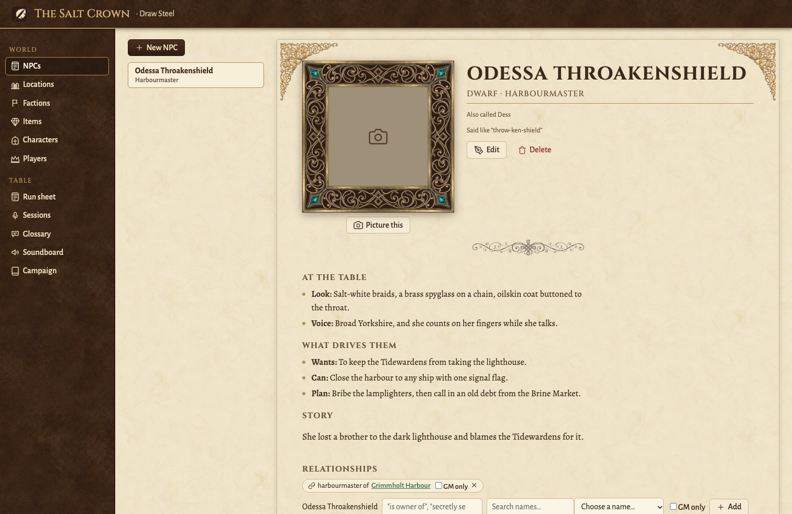
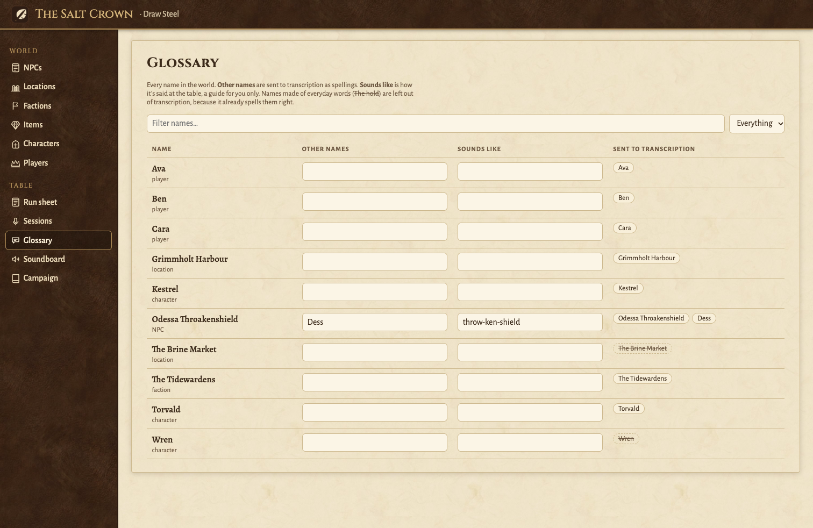

# bafft

A campaign manager for tabletop RPG game masters, run on your own machine.

- **Your world in one place.** NPCs, locations, factions, items, characters and players,
  and how they connect. Locations nest inside each other, and links can be kept GM-only.
- **AI help that knows your game system.** Draft NPCs and places for Draw Steel, D&D 5e or
  Shadowdark in seconds, flesh out what you've already written, and generate pictures in
  one consistent style. Nothing is saved until you approve it.
- **Session transcripts that get your made-up names right.** Upload a session recording.
  Your glossary of names is sent to the transcription service, so "Throakenshield" comes
  back spelled right. Then a labelling screen lets you click any word to hear it, check
  likely misheard names, fix them, and say which player is which speaker.
- **A soundboard for the table.** Music and ambience with crossfades and scenes. It can find
  more in free libraries (Tabletop Audio, Incompetech, Freesound, YouTube).
- **Run sheets** for each session, written in Markdown.





It is a single-user app with **no accounts**. Read [Security](#security) before running it
anywhere other people can reach.

## Run it with Docker (easiest)

You need [Docker](https://docs.docker.com/get-docker/) with Compose.

```bash
git clone https://github.com/mufasadb/bafft.git
cd bafft
cp .env.example .env      # then fill in the keys you want (see below)
docker compose up -d --build
```

Open http://localhost:8792. Your data (the database, recordings, pictures, sounds) lives in
a Docker volume called `bafft-data`. To back it all up into a folder:
`docker compose cp bafft:/data ./bafft-backup`.

To update: `git pull && docker compose up -d --build`. The database upgrades itself on start.

## Run it from source

You need Node 22 or newer and npm 10 or newer.

```bash
git clone https://github.com/mufasadb/bafft.git
cd bafft
npm install
cp .env.example .env      # optional: add keys
npm run dev
```

Open http://localhost:5173. The API runs on port 3001 behind it, and data goes in `./data`.

## API keys: which do I need?

**None, to start.** Without any keys you can build your whole world, run sessions from the
soundboard and write run sheets. Each key switches on one AI or library feature. Put the
keys in `.env` (Docker reads it through the compose file, and `npm run dev` reads it directly).

| Key | Switches on | Get one | Cost | Without it |
|---|---|---|---|---|
| `ASSEMBLYAI_API_KEY` | Session transcription | [assemblyai.com](https://www.assemblyai.com/dashboard/signup) | Pay as you go, roughly US$0.30 per hour of audio. New accounts get free credit. | Transcription returns a short sample sentence, so it's only good for trying the screens out |
| `GEMINI_API_KEY` | AI drafting and pictures | [Google AI Studio](https://aistudio.google.com/apikey) | Free tier available. Paid use is billed per request by Google. | Drafting and pictures return placeholder results |
| `FREESOUND_API_KEY` | Freesound sound effects in the soundboard's Find more | [freesound.org/apiv2/apply](https://freesound.org/apiv2/apply/) | Free | Freesound isn't searched |
| `YOUTUBE_API_KEY` | YouTube search in Find more | [Google Cloud console](https://console.cloud.google.com/apis/library/youtube.googleapis.com): enable YouTube Data API v3, then create an API key | Free daily quota | Search falls back to the Gemini key if that's allowed to use YouTube. Pasting a YouTube link always works. |

Tabletop Audio and Incompetech need no key.

<details>
<summary>Other settings</summary>

| Variable | Default | What it does |
|---|---|---|
| `BAFFT_PASSWORD` | unset | When set, the browser asks for this password (any username). See [Security](#security). |
| `BAFFT_MAX_UPLOAD_MB` | `4096` | Largest upload accepted, in MB. |
| `PORT` | `3001` (`8792` in Docker) | Server port. |
| `BAFFT_DATA_DIR` | `./data` (`/data` in Docker) | Where the database and files live. |
| `BAFFT_IMPORT_DIR` | unset | A folder of your own audio to add to the soundboard from, used in place. Mount it read-only in Docker. |
| `AUTO_TRANSCRIBE_ON_UPLOAD` | `false` | Start transcribing as soon as a recording is uploaded. |
| `BAFFT_UNCERTAIN_CONFIDENCE_THRESHOLD` | `0.4` | Words the transcriber is less sure of than this get marked for checking. |
| `BAFFT_ASR_PROVIDER` | `assemblyai` when its key is set, otherwise `mock` | Transcription service: `assemblyai`, `deepgram`, `speechmatics` or `mock`. |
| `DEEPGRAM_API_KEY`, `SPEECHMATICS_API_KEY` | unset | Alternative transcription services (AssemblyAI tested best on game sessions). |
| `BAFFT_DRAFT_PROVIDER`, `BAFFT_IMAGE_PROVIDER` | `gemini` when its key is set, otherwise `mock` | Force a provider. |
| `BAFFT_GEMINI_TEXT_MODEL`, `BAFFT_GEMINI_IMAGE_MODEL` | built in | Which Gemini models to use. |

</details>

## Security

bafft has **no user accounts**. Anyone who can reach its port can read and change your
campaign, upload files, and use your API keys, which can cost you money.

- **With Docker Compose**, the supplied `docker-compose.yml` only lets this computer in
  (`127.0.0.1:8792`). Opening it to your network is a one-line change, explained in the file.
- **From source**, the server listens on every network interface, so other devices on
  your network can reach port 3001.
- **On a home server**, keep it on your home network, or reach it through a private network
  such as [Tailscale](https://tailscale.com/). Don't forward the port on your router.
- **Set `BAFFT_PASSWORD`** whenever anyone else could reach it. Even then, put it behind
  HTTPS (a reverse proxy, or Tailscale) before using it over the internet, because a
  password sent over plain HTTP can be read on the way.

## For developers

npm workspaces: `packages/shared` (Zod schemas and types used on both sides),
`packages/server` (Express and Drizzle over SQLite) and `packages/web` (React and Vite).

| Command | Does |
|---|---|
| `npm run dev` | Server and web together, reloading on change. |
| `npm run typecheck` | Typechecks every package. |
| `npm test` | Unit tests for every package. |
| `npm run e2e` | End-to-end tests in Chrome against a real server, with fake AI services. Needs Google Chrome installed. |
| `npm run db:generate` | After changing `packages/server/src/db/schema.ts`: write the migration. |

Migrations run automatically when the server starts.

## Licence

[GNU AGPL v3](LICENSE) or later. You can use, change and share bafft freely. If you run a
changed version for other people, including as a hosted service, you must share your
changes under the same licence.
